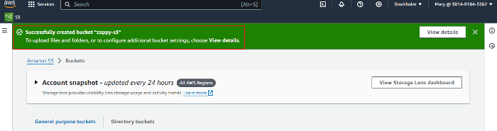

# Mini-Project: zappy-ebank

This hands-on project showcases my proficiency with Amazon Web Services (AWS), particularly focusing on utilizing Elastic Compute Cloud (EC2) and Simple Storage Service (S3) within an integrated framework.

The project simulates real-world applications, illustrating how EC2 and S3 collaborate to support dynamic financial services.

### Project Objectives
By the conclusion of this project, I will be able to:

- Demonstrate mastery in integrating EC2 and S3 to support a fintech application, effectively balancing compute and storage requirements.
- Show my practical experience in configuring a reverse proxy on EC2 to enable unified access to both EC2 and S3 resources.
- Showcase my comprehension of the importance of seamless resource integration in creating scalable and secure fintech solutions.
- Demonstrate my Deep understanding of AWS's potential to support fintech innovations through hands-on experience with its core services.

### Tools Utilized in this Project
- **GitBash:** Utilized as a terminal to connect to and interact with AWS.
- **Snipaste:** Used for capturing screenshots of the processes.
- **Google Chrome browser:** Used to access web services.
- **Visual Studio Code and Markdown:** Employed for project documentation.

### Setting up the EC2 instance

1. Launching EC2 instance. launch an ubuntu EC2 Instance.

2. Assign a Static IP (Elastic IP): Associate an Elastic IP address with the EC2 instance to ensure it retains the same public IP address across reboots.
- **STEP 1:** In the EC2 console navigation, select elastic ip and click on allocate elastic ip in the top right.

- **STEP 2:** Select the highlighted part in the image below

- **STEP 3:** Click on Allocate

- **STEP 4:** Select the highlighted parts and click on associate elastic ip

- **STEP 5:** Select the resource type, the instance you want to allocate the elastic ip address and the private ip of the elastic ip

### Creating S3 Bucket

1. Log in to the S3 console as Mary.

2. Create a new bucket and give it a name of your choice
- **STEP 1:**

- **STEP 2:**

- **STEP 3:**

- **STEP 4:**

- **STEP 5:**

3. Create a new object inside the bucket. You should upload an index.html file containing a simple content

### Configuring S3 Bucket for Web Hosting

- Enable Static Website Hosting: In you S3 bucket settings, enable static website hosting. This makes your bucket content accessible via HTTP.

1. Click on your bucket name

2. Click on properties tab and scroll down

3. Clic on edit as shown in the image (against static website hosting) 

4. Select the part highlighted in the image below

5. You have successfully enabled website hosting for your bucket

### Configuring a Web Server as a Reverse Proxy
Having successfully assigned an Elastic IP to my instance, the next step is to install Nginx. Nginx is a well-known open-source web server that also functions as a reverse proxy, load balancer, and HTTP cache. It is renowned for its high performance, stability, straightforward configuration, and minimal resource usage. Initially developed to address the "C10k problem" (managing 10,000 simultaneous connections), Nginx has achieved extensive adoption and is utilized by numerous large-scale websites and web applications.

1. update the package lists for the APT package manager.

2. On the Zapy-ebank EC2 instance, I will instal Nginx web server

3. Configure the Web Server: Configure the web server to serve your s3 app directly and to forward requests to your S3 bucket. Follow the steps below to configure your nginx.

- Create and edit a new file named **mybucket**: Introduce the configuration code in the file and paste your S3 link you generated after you enabled static web hosting for your bucket.

3. Make your index.html file public

- Navigate to the index.html file, click on **Actions** and then click on **Make public using ACL**

**Make public using ACL**

- Select **Make Public**

### Testing and Validation
After setting up your EC2 instance, configuring the S3 bucket, and establishing the reverse proxy, the next critical phase is testing and validation. This step is essential to ensure that your setup works as intended and that both the EC2-hosted application and the S3 bucket content are accessible through the unified access point you've created.

**Testing Step**
1. Direct Application Access:
- Access the application hosted on the EC2 instance directly through the Elastic IP to confirm it's running as expected.
- Verify that the application responds to requests and functions correctly without any reverse proxy interference.

### Conclusion
This hands-on project effectively demonstrates my skills with Amazon Web Services (AWS) by integrating Elastic Compute Cloud (EC2) and Simple Storage Service (S3) into a unified framework. The project simulates practical scenarios to illustrate the collaboration between EC2 and S3 in supporting dynamic financial services.

### By the end of this project, I have:

- Achieved expertise in integrating EC2 and S3 to balance compute and storage needs for a fintech application.
- Gained hands-on experience in setting up a reverse proxy on EC2 to facilitate unified access to EC2 and S3 resources.
- Recognized the significance of seamless resource integration in developing scalable and secure fintech solutions.
- Enhanced my understanding of AWS’s potential in supporting fintech innovations through practical use of its core services.

The tools used in this project included GitBash for terminal operations, Snipaste for process documentation, Google Chrome for web service access, and Visual Studio Code along with Markdown for creating documentation. Following detailed steps, I launched an EC2 instance, configured an S3 bucket, enabled static website hosting, and set up a reverse proxy using Nginx. Testing and validation confirmed that the setup worked as intended, providing a thorough learning experience in AWS resource integration.

